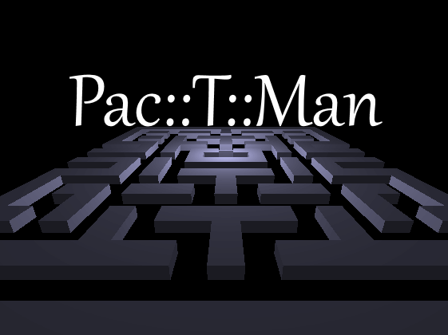
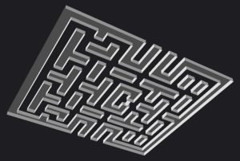
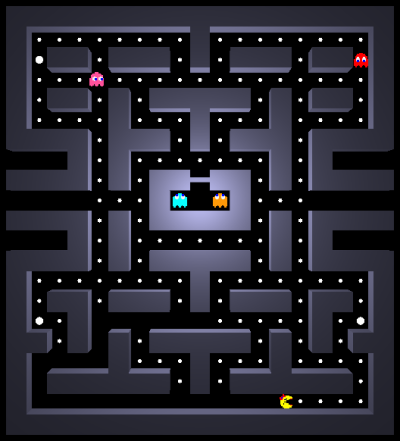
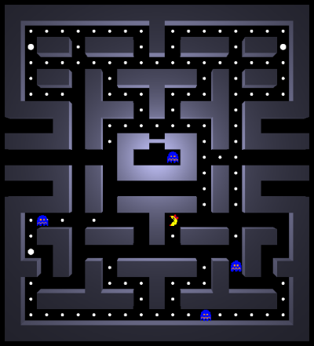

# Pac-T-Man
Project to implement my own *Pac-Man* game using *DirectX 11*. As an inpiration, the original version from 1980 was used.

  
  

There is dependency to *DirectXTK* which could be easily avoided but it is trivial to satisify it thru Nuget package thus I decided to keep it.

# Controls
- `Left/Right/Up/Down arrow` - movement.

  
  

The feeling from the game should be similar as you would have from playing the 1980's version.

# Features
- You can move around.
- You can be eaten by the ghosts.
- You can eat energizer (the big dot) and hunt the ghosts.
- The game follows different stages (ghosts can be chasing PacMan or running away).
- Each ghosts has its unique AI based on the 1980's version. Only one difference here - there is known and [documented bug](http://donhodges.com/pacman_pinky_explanation.htm) in Pinky and Inky behavior - I did not implmenet this to my version :blush:

# Additional information
Sprite sheet taken from [here](https://www.nicepng.com/ourpic/u2q8q8w7i1e6t4e6_pacman10-hp-sprite-pacman-sprite-sheet-png/). Only one dependency to compile the project is [DirectXTK](https://github.com/microsoft/DirectXTK) which really simplifies *DirectX* usage. The project is written in *Visual Studio 2017*.

World is generated from the 2D map in a form of cubes. Simple optimization to connect neighborhood cubes is done to minimaze number of the triangles and eliminate problems such as z-fighting. You can see it here from the bottom view:

  
  

Result is fully 3D world with dynamic point light ihabited by 2D billboards. Speed is locked to 60 PFS.

If you are interested in more details about PacMan in general, I can recommned these two sites what I was using as a reference and guide:

- [Understanding Pac-Man Ghost Behavior](https://gameinternals.com/understanding-pac-man-ghost-behavior)
- [The Pac-Man Dossier](https://www.gamasutra.com/view/feature/132330/the_pacman_dossier.php)

# Screenshots

  
  &nbsp; &nbsp; &nbsp; &nbsp; &nbsp; &nbsp; &nbsp; 

